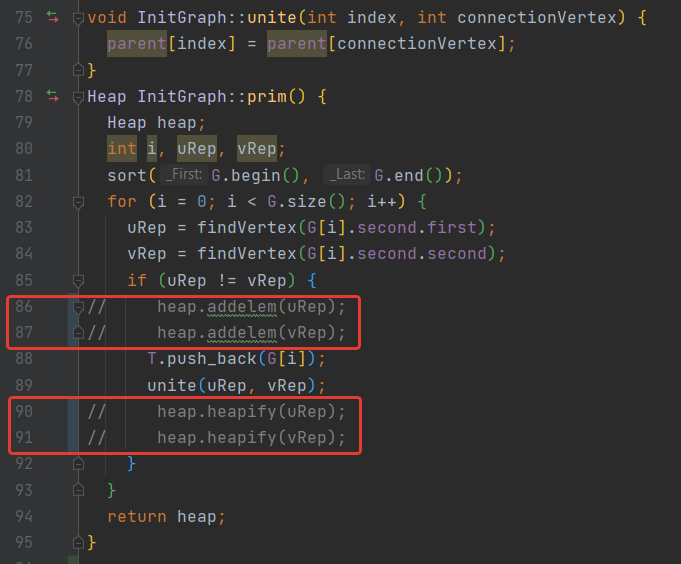
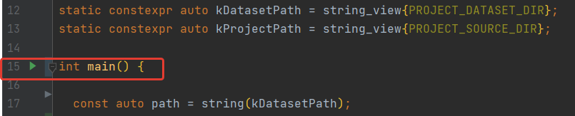
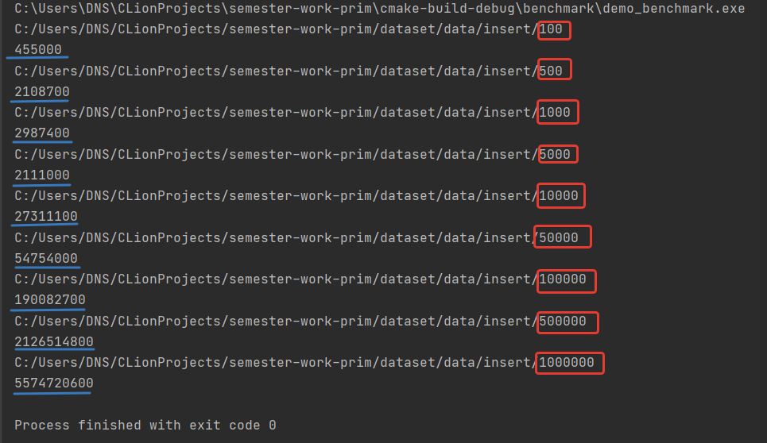
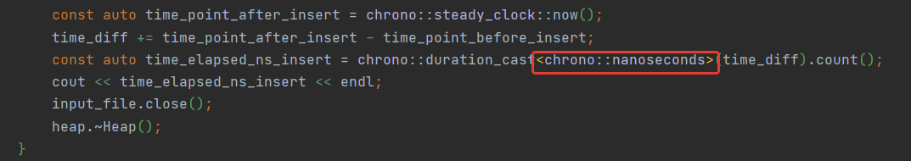

##**Алгоритм Прима** 

[](https://github.com/Algorithms-and-Data-Structures-2021/semester-work-prim)


_Краткое описание алгоритма Прима:_

- Алгоритм Прима - это алгоритм построения минимального остовного дерева, который в качестве входных данных принимает граф и находит подмножество его ребер. Формирует дерево, включающее в себя каждую вершину, а также имеет минимальную сумму весов среди всех деревьев, которые могут быть сформированы из графа.


- Алгоритм применяется в случаях, когда какие-либо данные удобно представлять в виде графов. Например, его используют протоколы маршрутизации OSPF и IS-IS.


- Алгоритм Прима заключается в следующем:
  
  * алгоритм начинает работу с произвольной вершины v;
  * определяются веса между выбранной вершиной v и остальными невыбранными вершинами;
  * выбирается вершина с наименьшим весом до нее, фиксируется выбранное ребро и вес;
  * выбранная вершина исключается из перечня невыбранных;
  * все эти шаги повторяются до тех пор, пока не будут выбраны все вершины.


~~~~
Сложность алгоритма по времени:

- при реализации с использованием массива -  O(n^2);
- при релизации с использованием двоичной кучи - O((n + m)log n).
~~~~

## _Команда "Team number seven"_


| Фамилия Имя   | Вклад (%) | Прозвище              |
| :---          |   ---:    |  ---:                 |
| Галеев Башир   | 35       | - |
| Рафикова Яна   | 30      | - |
| Терентьева Ольга   | 35       | - |

**Девиз команды**

~~ Мы маленькие дети, нам хочется гулять! ~~

## Структура проекта


- [`src`](src)/[`include`](include) - реализация алгоритма (исходный код и заголовочные файлы);
- [`benchmark`](benchmark) - контрольные тесты производительности алгоритма;
- [`dataset`](dataset) - наборы данных для запуска контрольных тестов и их генерация;

## Требования (Prerequisites)


1. С++ компилятор c поддержкой стандарта C++17 (например, _GNU GCC 8.1.x_ и выше).
2. Система автоматизации сборки _CMake_ (версия _3.12.x_ и выше).
3. Рекомендуемый объем оперативной памяти - не менее 5 ГБ.
4. Свободное дисковое пространство объемом ~ 3 ГБ (набор данных для контрольных тестов).

## Сборка и запуск


### Пример (Windows)

#### Сборка проекта


Склонируйте проект к себе на устройство через [Git for Windows](https://gitforwindows.org/) (либо используйте
возможности IDE):

```shell
https://github.com/Algorithms-and-Data-Structures-2021/semester-work-prim
```

Для ручной сборки проекта в терминале введите:

```shell
# переход в папку с проектом
cd C:\Users\username\asd-projects\semester-work-prim

# создание папки для файлов сборки (чтобы не засорять папку с проектом) 
mkdir -p build && cd build 

# сборка проекта
cmake .. -DCMAKE_BUILD_TYPE=RelWithDebInfo && cmake --config RelWithDebInfo --build . 
```


#### Генерация тестовых данных


Тестовые наборы данных в
формате [comma-seperated values (CSV)](https://en.wikipedia.org/wiki/Comma-separated_values):

```shell
# входные данные для тестов находятся в папке
cd dataset/data/Insert
```


Тестовые данные представлены в CSV формате: 

```csv
0 1 3
1 2 1
2 3 3
3 4 7
4 5 4
...
```


#### Контрольные тесты (benchmarks)


Для запуска контрольных тестов необходимо предварительно сгенерировать или скачать готовый [набор тестовых данных](https://drive.google.com/drive/folders/1HQv5lb7RafyaPbL2Fq8msGzW07QNAxfO).


##### Список контрольных тестов

| Название                  | Описание                                | Метрики         |
| :---                      | ---                                     | :---            |
| `benchmark` | алгоритм Прима  | _время_         |


##### Пример запуска

Для начала открываем код в редакторе, например, в CLine и открываем класс data_structure.cpp.

Затем ищем данный фрагмент кода и убеждаемся, что строки 86 и 87, а также 90 и 91 закомментированы.



Далее переходим в класс demo_benchmark.cpp и запускаем код:



В консоль будет выводится время сразу для всех наборов тестовых данных:



Также можно изменить меру времени. Например, выводить время в милли-, а не наносекундах:


## Источники


* [Алгоритм Прима - Библиотека алоритмов на графах](http://urban-sanjoo.narod.ru/prim.html) 


* [MAXimal - Алгоритм Прима](https://e-maxx.ru/algo/mst_prim)


* [Алгоритм Прима на C#](https://vscode.ru/prog-lessons/algoritm-prima-na-c-sharp.html)

